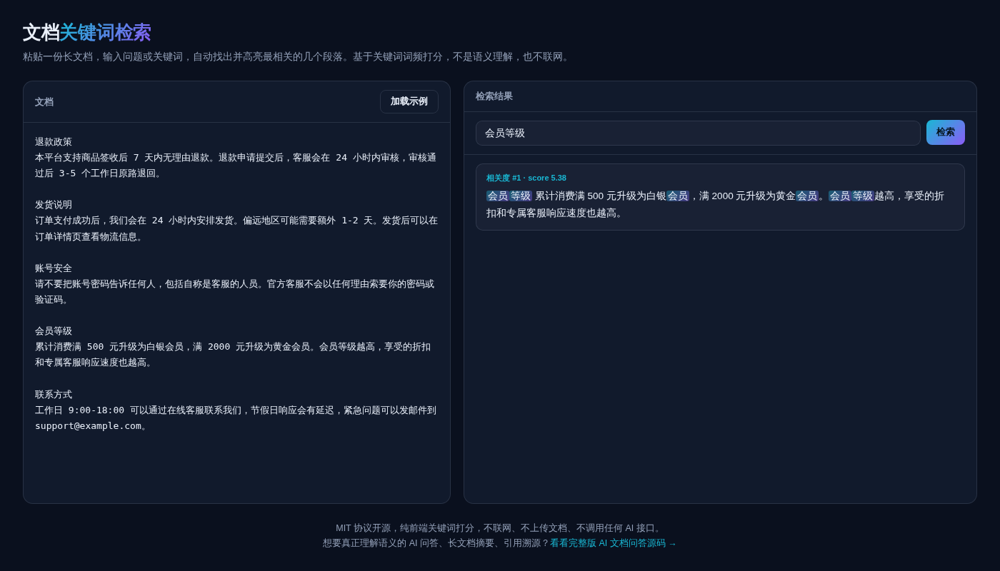

# 文档关键词检索 · Doc Search

**[在线体验 →](https://anna123123123-creator.github.io/doc-search/)**

免费开源、纯浏览器运行的文档关键词检索工具。粘贴一份长文档，输入问题，自动定位并高亮最相关的几个段落——基于经典的 TF-IDF 关键词打分算法，不联网、不上传文档、不调用任何 AI 接口。



## 试用方法

直接用浏览器打开 `index.html`，或用静态文件服务器跑起来：

```bash
python3 -m http.server 8000
```

文档按空行分段，输入问题后会给每个段落打分并按相关度排序，展示前 5 条。

## 实现原理

- **分词**：英文按单词切分，中文用滑动窗口切成二元词组（bigram），不需要任何分词库
- **打分**：经典 TF-IDF 思路——一个关键词在越少的段落里出现，它出现时的权重就越高（`log(1 + 段落总数 / 包含该词的段落数)`），一个段落命中的关键词权重加总就是它的相关度分数
- **排序**：按分数降序，取分数大于 0 的前 5 段

这是"关键词检索"，不是语义理解——问"退款"能找到含"退款"字样的段落，但换一种完全不同的说法（比如"钱能退回来吗"完全不含"退"字）就未必能匹配到。这正是它和真正 AI 问答的区别。

## 协议

MIT。

## 相关项目

这个是做 **AI 文档问答**产品时顺手做的免费小工具——只是关键词打分检索，不理解语义、不生成摘要、不做引用溯源。完整版是真正的 AI 语义问答，支持长文档摘要、关键信息问答、引用溯源，源码在这：[全能源码 · AI 文档问答网站源码](https://inzyxuashop.com/aiwenshu-yuanma.html)。
